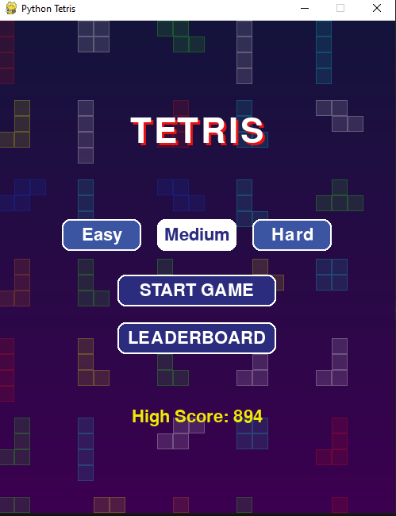
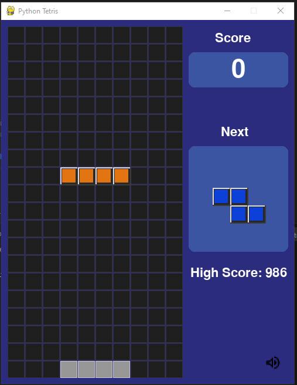
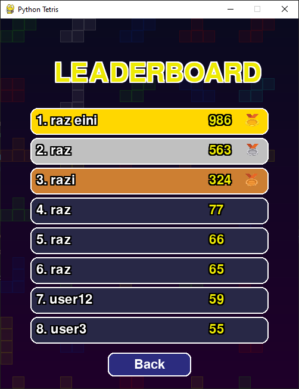
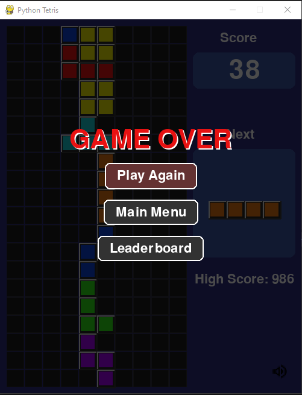

  <h1>🎮 Tetris Game – Python + Pygame</h1>

  

    מימוש קלאסי של משחק <strong>טטריס</strong> לדסקטופ, עם אנימציות חלקות, מוזיקת רקע, רמות קושי משתנות, ומסכי אינטראקציה משודרגים.
  

  <!-- גלריה ל-GitHub README.md -->
<table>
  <tr>
    <td align="center">
      
       <b>מסך פתיחה</b>
    </td>
    <td align="center">
      
       <b>מסך משחק</b>
    </td>
    <td align="center">
      
       <b>לוח מובילים</b>
    </td>
    <td align="center">
      
       <b>מסך סיום</b>
    </td>
  </tr>
</table>

  

    
    
    
    
  

  

  <h2>🚀 Features</h2>

  <table>
    <thead>
      <tr>
        <th>תחום</th>
        <th>תכונה</th>
        <th>סטטוס</th>
        <th>הערות</th>
      </tr>
    </thead>
    <tbody>
      <tr>
        <td>🎲 לוגיקת משחק</td>
        <td>נפילת טטרומינו קלאסית</td>
        <td>✅</td>
        <td>פיזיקה בסיסית</td>
      </tr>
      <tr>
        <td>↔️ תנועה</td>
        <td>הזזה שמאלה/ימינה/למטה + סיבוב</td>
        <td>✅</td>
        <td>שליטה במקלדת</td>
      </tr>
      <tr>
        <td>👻 בלוק רפאים</td>
        <td>תצוגה מקדימה של מיקום הנחיתה</td>
        <td>✅</td>
        <td>משפר UX</td>
      </tr>
      <tr>
        <td>🧹 ניקוי שורות</td>
        <td>ניקוי שורה מלאה והוספת ניקוד</td>
        <td>✅</td>
        <td>מימוש מלא</td>
      </tr>
      <tr>
        <td>📈 ניקוד</td>
        <td>מערכת ניקוד דינמית</td>
        <td>✅</td>
        <td>עולה עם רמות</td>
      </tr>
      <tr>
        <td>⚡ רמות קושי</td>
        <td>בחירת מהירות/קושי</td>
        <td>✅</td>
        <td>קצב ירידה משתנה</td>
      </tr>
      <tr>
        <td>🎵 סאונד</td>
        <td>מוזיקת רקע ואפקטים</td>
        <td>✅</td>
        <td>Pygame.mixer</td>
      </tr>
      <tr>
        <td>💀 סוף משחק</td>
        <td>מסך Game Over עם כפתורים אינטראקטיביים</td>
        <td>✅</td>
        <td>כולל כפתורים Play Again, Main Menu, Leaderboard</td>
      </tr>
      <tr>
        <td>🏆 Leaderboard</td>
        <td>טבלת ניקוד עם גלילה ותצוגת 20 שיאים עליונים</td>
        <td>✅</td>
        <td>בלוקים רקע ואפקטים ויזואליים</td>
      </tr>
      <tr>
        <td>🔄 ריסט</td>
        <td>התחלת משחק חדש בלחיצה</td>
        <td>✅</td>
        <td>Reset קל</td>
      </tr>
      <tr>
        <td>🎬 אנימציות</td>
        <td>תנועה חלקה ורספונסיביות</td>
        <td>✅</td>
        <td>FPS יציב</td>
      </tr>
    </tbody>
  </table>

  

<h2>⚙️ Installation / התקנה</h2>

  כדי להריץ את המשחק, יש צורך ב־<strong>Python 3.8+</strong> ובספריית <strong>Pygame</strong>.  
  מודולים נוספים כמו <code>os</code>, <code>sys</code>, <code>json</code> ו־<code>random</code> מובנים כבר ב‑Python ואין צורך בהתקנה נפרדת.

<table>
  <tr>
    <td><strong>שלב 1:</strong> התקנת Pygame</td>
    <td><code>pip install pygame</code></td>
  </tr>
  <tr>
    <td><strong>שלב 2:</strong> הרצת המשחק</td>
    <td><code>python main.py</code></td>
  </tr>
</table>

  כאשר המשחק רץ לראשונה, הקבצים הבאים נוצרים אוטומטית אם הם אינם קיימים:

<ul>
  <li><code>leaderboard.json</code> – רשימת השיאים (Leaderboard)</li>
  <li><code>config.json</code> – שמירת הגדרות המשתמש</li>
  <li><code>highscore.txt</code> – ניקוד הגבוה ביותר</li>
</ul>

  יש לוודא שהתיקייה <code>images/</code> קיימת ומכילה את כל התמונות הדרושות:

<ul>
  <li><code>medal-gold.png</code></li>
  <li><code>medal-silver.png</code></li>
  <li><code>medal-bronze.png</code></li>
  <li>תמונות מסכי המשחק: <code>tetris_image1.PNG</code>, <code>tetris_image2.PNG</code>, <code>tetris_image3.PNG</code>, <code>tetris_image4.PNG</code></li>
</ul>

  לאחר ההתקנה, פשוט הריצו את הקובץ הראשי:
  <code>python main.py</code>

  <h2>🛠️ Tech Stack</h2>
  <ul>
    <li><strong>Language:</strong> Python</li>
    <li><strong>Library:</strong> Pygame</li>
    <li><strong>Paradigm:</strong> Object-Oriented Programming (OOP)</li>
  </ul>

  

  <h2>📄 רישיון</h2>
  

    הפרויקט מופץ תחת רישיון <strong>MIT</strong> – חופשי לשימוש, שינוי והפצה, כל עוד נשמר קרדיט למחבר.
  

  
למידע נוסף ראה את קובץ <a href="LICENSE">LICENSE</a>

  

  
<strong>👨‍💻 Raz Eini (2025)</strong>

